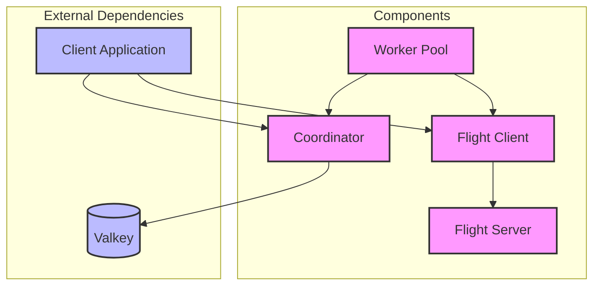

# ValkeyFlight Project Summary

## Project Overview

ValkeyFlight is a high-performance, zero-copy data pipeline system designed to efficiently move and process large volumes of data stored in Apache Arrow format. It provides a lightweight alternative to full workflow engines while maintaining critical reliability features such as retry logic, durability, and failure detection.

## Key Goals

1. **High Performance**: Achieve maximum throughput with minimal overhead using Arrow Flight's zero-copy data movement
2. **Reliability**: Ensure data is processed reliably with automatic retries and failure detection
3. **Simplicity**: Provide a lightweight system that's easy to deploy and operate
4. **Scalability**: Support horizontal scaling for both workers and servers

## System Components



### Core Components

1. **Flight Server** (`flight_server/`)
   - In-memory storage for Arrow record batches
   - Implementation of Flight protocol (DoGet, DoPut, GetFlightInfo)
   - TTL-based cleanup of expired batches
   - Thread-safe batch management

2. **Flight Client** (`flight_client/`)
   - Client-side interface to the Flight server
   - Methods for storing and retrieving Arrow record batches
   - Connection management and error handling

3. **Coordinator** (`internal/coordinator/`)
   - Batch metadata tracking using Valkey
   - Status management (pending, processing, completed, failed)
   - Retry counting and stale batch detection
   - Atomic transaction handling for consistent state updates

4. **Worker Pool** (`internal/worker/`)
   - Polling for pending batches
   - Concurrent batch processing
   - Exponential backoff for retries
   - Graceful shutdown handling

5. **Common Types** (`internal/types/`)
   - Core data structures and types used throughout the system
   - Batch metadata definitions
   - Status enumerations

### Command-Line Interface

The application can be run via the CLI (`cmd/valkeyflight/`) which supports different operational modes:

- `all`: Run all components in a single process
- `coordinator`: Run only the coordinator component
- `worker`: Run only the worker component
- `flight`: Run only the Flight server component

## Project Structure

```
valkeyflight/
├── cmd/
│   └── valkeyflight/      # Command-line application
├── flight_client/         # Standalone Flight client
├── flight_server/         # Standalone Flight server
├── internal/
│   ├── coordinator/       # Valkey-based metadata coordinator
│   ├── flight/            # Internal Flight client
│   ├── types/             # Common data types
│   └── worker/            # Worker implementation
├── ARCHITECTURE.md        # Detailed system architecture
├── GETTING_STARTED.md     # Getting started guide
├── PROJECT_SUMMARY.md     # This project summary
├── README.md              # Main README with usage information
├── go.mod                 # Go module definition
└── go.sum                 # Go dependencies checksum
```

## Technical Stack

- **Language**: Go 1.24+
- **Data Format**: Apache Arrow
- **Transport**: Apache Arrow Flight (gRPC-based)
- **Metadata Storage**: Valkey (Redis fork)
- **Dependencies**:
  - `github.com/apache/arrow-go`: Arrow implementation in Go
  - `github.com/valkey-io/valkey-go`: Valkey client for Go
  - Standard Go libraries for concurrency and context handling

## Workflow Process

1. **Batch Registration**:
   - Client creates Arrow record batch
   - Client stores batch in Flight server
   - Client registers batch with coordinator

2. **Batch Processing**:
   - Worker polls for pending batches
   - Worker marks batch as processing
   - Worker retrieves batch from Flight server
   - Worker processes batch
   - Worker updates batch status

3. **Error Handling**:
   - Failed processing increments retry count
   - Retries use exponential backoff
   - Stale batches are detected and retried
   - Batches exceeding max retries are marked as failed

## Performance Characteristics

- **Throughput**: Optimized for high-throughput batch processing
- **Latency**: Low latency for metadata operations
- **Memory Usage**: Efficient memory utilization through Arrow's columnar format
- **CPU Usage**: Reduced CPU overhead due to zero-copy data movement

## Use Cases

ValkeyFlight is particularly well-suited for:

1. **Data ETL Pipelines**: Processing large volumes of structured data
2. **Analytics Workflows**: Moving data between analytics systems
3. **Batch Processing**: Any scenario requiring reliable batch processing
4. **Microservice Integration**: When services need to exchange large datasets

## Comparison to Alternatives

| System | ValkeyFlight | Temporal | Kafka | Apache Airflow |
|--------|--------------|----------|-------|----------------|
| **Focus** | High-performance data movement | Workflow orchestration | Messaging/streaming | DAG-based workflows |
| **Data Model** | Arrow record batches | Any (serialized) | Messages/events | Any (task result) |
| **Performance** | Very high (zero-copy) | Good | Very high | Moderate |
| **Complexity** | Low | High | Medium | High |
| **Scaling Model** | Horizontal | Horizontal | Horizontal | Horizontal |
| **State Management** | Simple metadata | Full history | Offset tracking | Database |

## Future Development

Potential areas for enhancement include:

1. **Metrics and Monitoring**: Integration with Prometheus/Grafana
2. **Authentication**: Adding auth for Flight and Valkey connections
3. **Plugins**: Pluggable processing logic for workers
4. **Web UI**: Admin interface for monitoring and management
5. **Cluster Mode**: Native clustering support for high availability

## License

This project is licensed under the Apache License 2.0.
