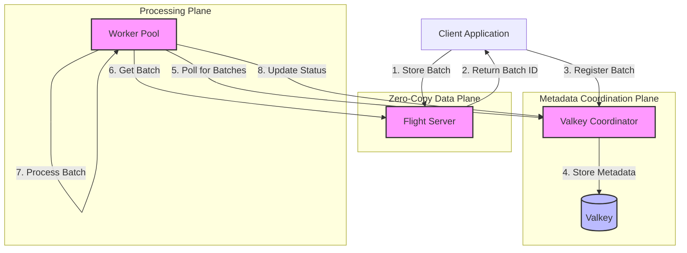

# ValkeyFlight: High-Performance Data Pipeline with Apache Arrow Flight and Valkey

ValkeyFlight is a high-performance, zero-copy data pipeline that moves Apache Arrow record batches using Arrow Flight with Valkey (Redis fork) as a lightweight coordination layer. It provides durability, retry logic, and batch tracking similar to what Temporal offers, but with minimal overhead and without a full workflow engine.

## Architecture

The system consists of the following components:

1. **Flight Server**: Accepts and serves Arrow record batches via Arrow Flight with zero-copy for high performance.

2. **Valkey Metadata Layer**: Coordinator component that uses Valkey to store batch metadata and provide operations like batch registration, status updates, and retry handling.

3. **Worker Pool**: Worker service that polls for pending batches, processes them, and handles retry logic with exponential backoff.



## Features

- **Zero-copy data movement** via Apache Arrow Flight
- **Durable, retryable coordination** via Valkey
- **No external workflow engine** needed
- **Exponential backoff** for retries with jitter
- **Graceful handling** of worker failures via heartbeats
- **Modular architecture** with clean separation of concerns

## Components

### 1. Flight Server

The Flight Server is responsible for:

- Storing Arrow record batches
- Serving Arrow record batches
- Managing batch TTL/expiration
- Providing a high-performance data transport layer

### 2. Coordinator

The Coordinator manages batch metadata using Valkey and provides:

- Batch registration
- Status tracking (pending, processing, completed, failed)
- Retry counting
- Stale batch detection
- Batch expiration based on TTL

### 3. Worker Pool

The Worker Pool:

- Polls for pending batches
- Processes batches
- Implements retry logic with exponential backoff
- Handles failures gracefully
- Updates batch status

## Getting Started

### Prerequisites

- Go 1.24 or later
- Running Valkey (or Redis) server
- Arrow Flight server

### Installation

```bash
go build -o valkeyflight ./cmd/valkeyflight
```

### Running

The application can be run in different modes:

```bash
# Run all components
./valkeyflight --mode=all

# Run only the coordinator
./valkeyflight --mode=coordinator --valkey-addr=localhost:6379

# Run only workers
./valkeyflight --mode=worker --valkey-addr=localhost:6379 --flight-addr=localhost:8080 --workers=4

# Run with custom retry settings
./valkeyflight --max-retries=5 --poll-interval=10s
```

## Configuration Options

| Flag | Description | Default |
|------|-------------|---------|
| `--mode` | Operation mode: 'all', 'coordinator', 'worker', or 'flight' | `all` |
| `--valkey-addr` | Valkey server address | `localhost:6379` |
| `--valkey-password` | Valkey server password | `""` |
| `--flight-addr` | Arrow Flight server address | `localhost:8080` |
| `--workers` | Number of worker goroutines | `2` |
| `--poll-interval` | Polling interval for workers | `5s` |
| `--max-retries` | Maximum number of retries for failed batches | `3` |
| `--verbose` | Enable verbose logging | `false` |

## Batch Processing Flow

1. A client stores a batch in the Flight server and receives a batch ID
2. The client registers the batch with the coordinator using the batch ID
3. Workers poll for pending batches and select one to process
4. The worker retrieves the batch from the Flight server
5. The worker processes the batch and updates its status
6. If processing fails, the batch is retried with exponential backoff

## API and Usage

### Flight Client API

```go
// Create a new Flight client
client, err := flight.NewFlightClient(flight.FlightClientConfig{
    Addr:      "localhost:8080",
    Allocator: memory.NewGoAllocator(),
})

// Store a batch
batchID, err := client.StoreBatch(ctx, recordBatch)

// Retrieve a batch
batch, err := client.GetBatch(ctx, batchID)
```

### Coordinator API

```go
// Create a new coordinator
coordinator, err := coordinator.New(coordinator.Config{
    ValKeyAddr:     "localhost:6379",
    ValKeyPassword: "",
    MaxRetries:     3,
})

// Register a batch
err := coordinator.RegisterBatch(ctx, batchID)

// Mark a batch as processing
err := coordinator.MarkProcessing(ctx, batchID)

// Mark a batch as completed
err := coordinator.MarkCompleted(ctx, batchID)

// Increment retry counter
err := coordinator.IncrementRetry(ctx, batchID)

// List pending batches
batches, err := coordinator.ListPendingBatches(ctx)
```

### Worker API

```go
// Create a new worker
worker, err := worker.New(worker.Config{
    Coordinator:  coordinator,
    FlightClient: flightClient,
    WorkerCount:  4,
    PollInterval: 5 * time.Second,
})

// Start the worker pool
worker.Start()

// Shutdown gracefully
err := worker.Shutdown(ctx)
```

## Performance Considerations

- ValkeyFlight is designed for high-throughput data processing scenarios
- The Arrow Flight protocol enables zero-copy data movement
- Valkey provides low-latency metadata operations
- Worker pools can be scaled horizontally across machines

## Comparison with Temporal

While Temporal provides a full workflow engine with many features, ValkeyFlight focuses on lightweight, high-performance batch processing:

| Feature | ValkeyFlight | Temporal |
|---------|-------------|----------|
| Data Transport | Arrow Flight (zero-copy) | gRPC |
| Coordination | Valkey (lightweight) | Persistence store (Cassandra/SQL) |
| Retry Logic | ✅ | ✅ |
| Workflow State | ❌ | ✅ |
| Versioning | ❌ | ✅ |
| Query Capability | Limited | Extensive |
| Performance | Very high | High |
| Memory Usage | Lower | Higher |

## License

This project is licensed under the Apache License 2.0 - see the LICENSE file for details.
